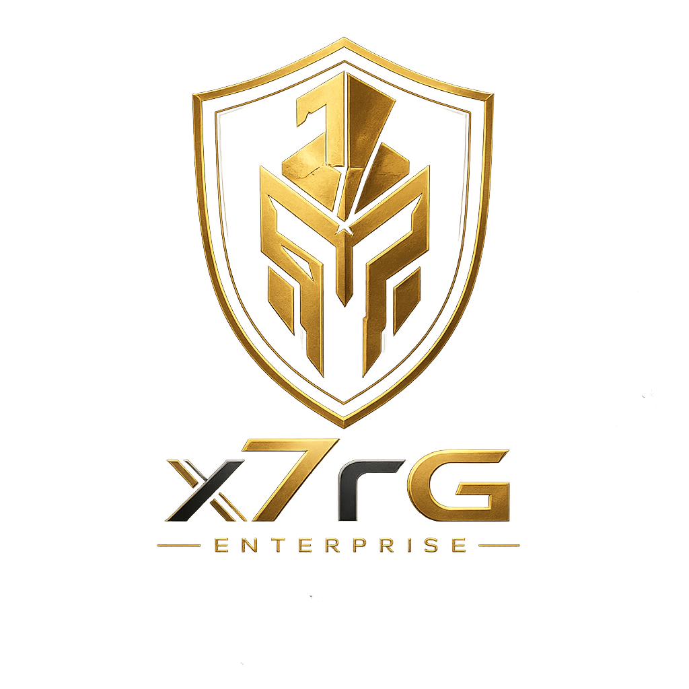
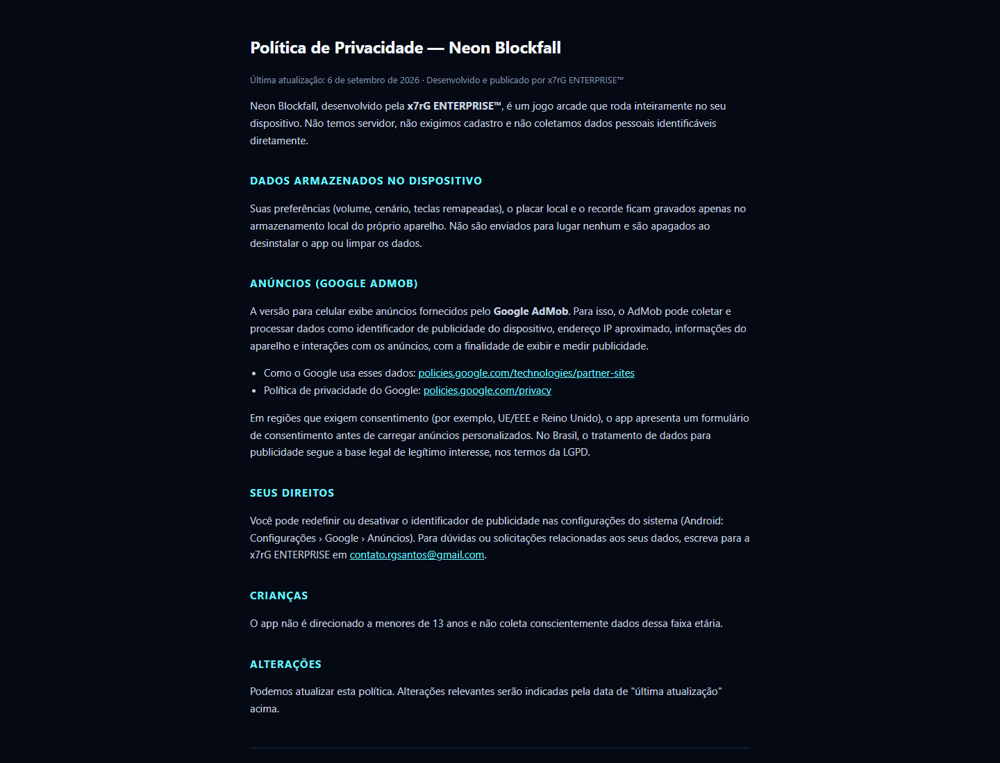

<div align="center">



# Neon Blockfall — Política de Privacidade

**Página pública e bilíngue com as informações de privacidade do Neon Blockfall.**

[](https://xx7rg.github.io/neon-blockfall-privacy/)


[](https://github.com/xx7rg/neon-blockfall-privacy/actions/workflows/ci.yml)

**[Consultar a política de privacidade](https://xx7rg.github.io/neon-blockfall-privacy/)**

Publicado por **x7rG ENTERPRISE™**

</div>

---



## Sobre o repositório

Este repositório hospeda a política de privacidade pública do **Neon Blockfall** para consulta pelos jogadores e apresentação na Google Play. O código do jogo permanece em um repositório privado.

A página explica, em português e inglês:

- quais preferências e informações de progresso ficam armazenadas no dispositivo;
- como o Google AdMob pode tratar dados relacionados à publicidade;
- como o usuário pode controlar o identificador de publicidade;
- o canal de contato para dúvidas e solicitações;
- as condições relacionadas a crianças e futuras alterações da política.

## Estrutura

```text
neon-blockfall-privacy/
├── index.html            # Política publicada em português e inglês
├── docs/images/          # Logo e imagem usadas neste README
├── scripts/validate_static.py # Verificação dos arquivos e links locais
├── .github/workflows/ci.yml   # Validação automática no GitHub
└── README.md             # Apresentação e instruções do repositório
```

## Visualizar localmente

Não há dependências nem etapa de compilação. Clone o repositório e inicie um servidor HTTP com Python 3:

```bash
git clone https://github.com/xx7rg/neon-blockfall-privacy.git
cd neon-blockfall-privacy
python -m http.server 8000
```

Depois, acesse [http://localhost:8000](http://localhost:8000).

No macOS/Linux, use `python3` se o comando `python` não estiver disponível.

## Validar antes de publicar

Em outro terminal, dentro da pasta do repositório, execute:

```bash
python scripts/validate_static.py
```

No macOS/Linux, também pode usar `python3 scripts/validate_static.py`.
A verificação confere a declaração HTML, os arquivos e as âncoras dos links
locais, além das imagens e referências locais do README. Links externos
precisam ser conferidos separadamente; o script não revisa o conteúdo legal.

## Publicação

O site é formado por arquivos estáticos. Após revisar `index.html` e executar
a validação, envie a alteração para a branch `main` e confira a página
publicada pelo GitHub Pages. O Pages publica os arquivos da raiz de `main`,
sem etapa de compilação. A CI verifica as referências em pushes e pull requests.

---

<div align="center">

**© 2026 x7rG ENTERPRISE™** — Todos os direitos reservados.

[](https://www.linkedin.com/in/rgds)
&nbsp;
[](https://www.instagram.com/_7ragnar/)

</div>
